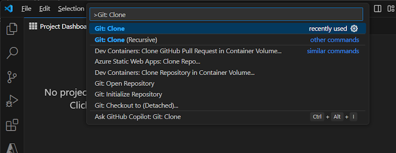
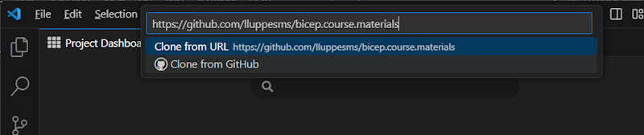
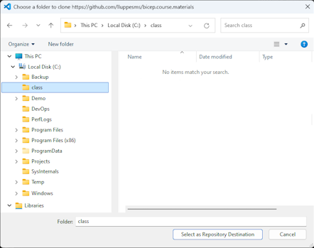
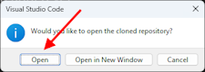
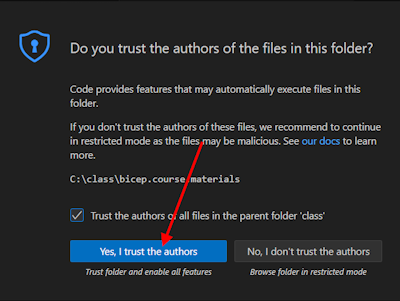
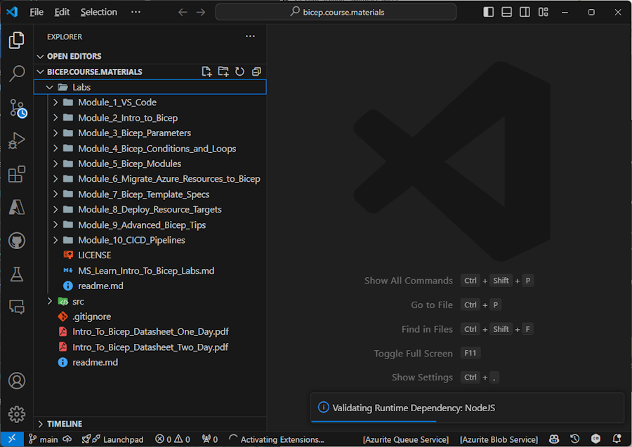

# Bicep Lab 1: Pre-Requisites

Pre-Req Exercises:

* If you have not created an Organization and a Project in Azure DevOps, please start with the preparation tasks in the [Create an Azure DevOps Project](../../setup/1-Create-Azdo-Project.md) guide.

* If you have not installed VS Code,  please follow the instructions in the [Set up Visual Studio Code](../../setup/3-Visual-Studio-Code.md)

* If you have not created your own repository for the class based on the course materials, please follow the instructions in the [Import the Class Repository](../../setup/4-Clone-Repo.md) guide.

* If you need a custom Build Agent and have not created one yet, you can install a Build Agent on your VM or your Local Machine.  Please follow the instructions in the [Create a Custom Build Agent](../../build-agents/desktop-runner/readme.md) guide.

<!-- 
1. Open VS Code and clone the repository. Press F1 or Ctl-Shift-P (Windows) and type Git: Clone and paste the following URL:

``` bash
https://github.com/lluppesms/activate.cicd.course
```





Choose a folder on your disk where you want to store the repository, open it, and then trust the authors of the repository:







You should now have all of the lab materials available in your VS Code environment.



You should be all set to start the labs! -->

---

This completes this lab.

[Next Lab](../02_Intro/readme.md) | [Table of Contents](../readme.md)
