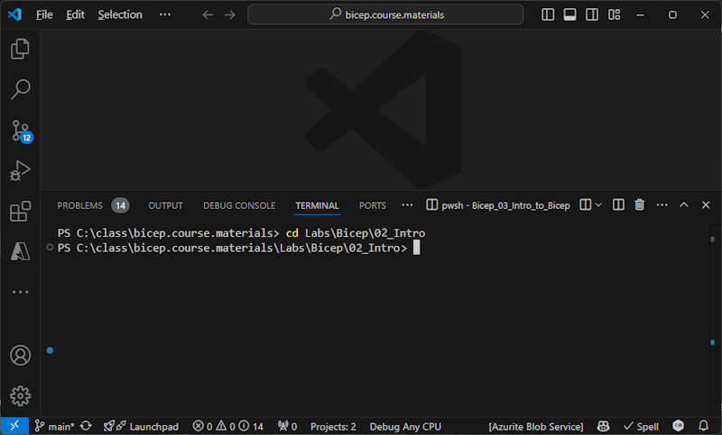

# Bicep Lab 2: Introduction to Bicep Templates - Define a resource using Bicep

## Setup Steps

* If you have not created your own repository for this class based on the course materials, please follow the instructions in the [Import the Class Repository](../../setup/3-Clone-Repo.md) guide.

---

Open the repository in VS Code, then open a terminal in VS Code (menu: Terminal -> New Terminal) and execute the following command to change to the Lab 2 folder:

``` bash
cd Labs\Bicep\02_Intro
```

  

In order to create things in Azure you may (probably) need to login to Azure first.  Run this command and follow the instructions to login.

``` bash
az login
```

If you have access to more than one subscription you will need to set the default to a specific one:

``` bash
az account set --subscription <yourSubscriptionId>
```

---

## Define your Resource Group

All resources in Azure are stored in a Resource Group.  You may have a resource group provided for you, or you will need to create a Resource Group to hold the resources we will create in this class.  To create a resource group, you can use the following command (substitute your own values for the resource group name and location). You can also use the `az group show` command to verify the resource group was created successfully.

> If you are sharing a subscription with others in this class, you will want a unique resource group name, so you may want to add your initials or a number to the resource group name. 
**For the rest of the course, wherever you see `rg_demo` you should replace it with the name of your resource group.**

``` bash
az group create --name rg_demo --location eastus
```

To verify the resource group was created successfully or that you have access, run the following command:

``` bash
az group show --resource-group rg_demo
```

---

## Deploy a Simple Resource

Let's begin by deploying the simplest bicep file.  Open the file `simplest-loganalytics.bicep` in VS Code and review the contents.  This file will create a Log Analytics Workspace in the resource group you created in the previous step. When you are ready, run the following command in the terminal window to deploy the bicep file:

``` bash
$resourceGroupName="rg_demo"
az deployment group create `
 --resource-group $resourceGroupName `
 --template-file simplest-loganalytics.bicep

```

Open the Azure portal and find your resource group and your new Log Analytics Workspace.  Review the properties of the workspace.

Once you have looked at the resource, let's practice cleaning up.  Run the following command to delete the workspace. Note the `--force` parameter which will do a forced purge (no recovery possible) which will let you re-use this name in the future.

``` bash
$resourceGroupName="rg_demo"
az monitor log-analytics workspace delete `
 --resource-group $resourceGroupName `
 --workspace-name logAnalytics01 `
 --force
 
```

<!-- ------------------------------------------------------------------------------------------ -->
---

At this point, we have successfully connected to Azure and deployed a resource using a Bicep template! This completes this lab.

[Next Lab](../03_Parameters/readme.md) | [Previous Lab](../02_Intro/readme.md) | [Table of Contents](./readme.md)
