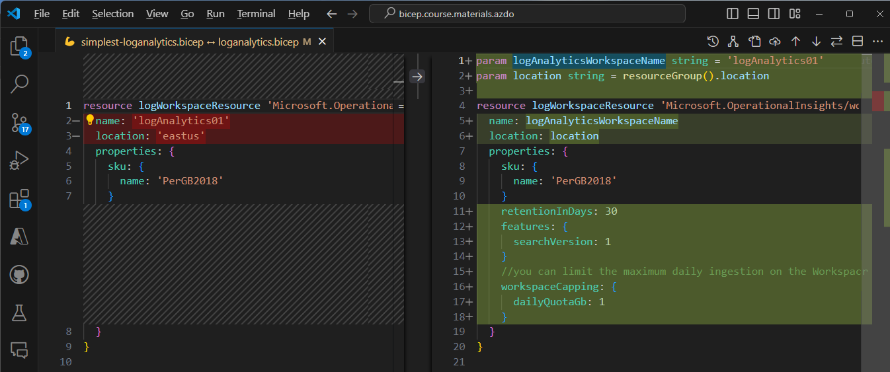

# Bicep Lab 3: Build reusable Bicep templates by using parameters

## Deploying a Bicep template with defaults

Open the [loganalytics.bicep](./loganalytics.bicep) file and compare it to the [simple file](./simplest-loganalytics.bicep) you deployed in the previous lab.  The very simple file we deployed in the last lab had very few values and just took the defaults for everything.  In this version we will start to introduce new parameters to deploy the resource exactly how we want it deployed.

You can compare files in VS Code by clicking on the file you want to compare and then control-clicking on the second file you want to compare to select TWO files, then right-clicking on one of the files and select `Compare Selected`.  You can see that the new file still has the same default values, but they are defined on `param` statements so they can be overridden.

  

To begin this lab, open the Terminal and change the directory to the one where the Bicep file is located, using a command similar to the following:

``` bash
cd ..\03_Parameters\
```

Let's deploy a workspace using the defaults with the same command as in the previous lab, with no parameter overrides.:

``` bash
$resourceGroupName="rg_demo"
az deployment group create `
 --resource-group $resourceGroupName `
 --template-file loganalytics.bicep

```

## Supplying a Parameter

We can deploy a second workspace by simply overriding the logAnalyticsWorkspaceName parameter with a new name on the command line:

``` bash
az deployment group create `
 --resource-group $resourceGroupName `
 --template-file loganalytics.bicep `
 --parameters logAnalyticsWorkspaceName=logAnalytics02
 
```

Once your deploy has finished, review your resources in Azure to ensure that the new workspace was created as expected.

## Adding New Parameters

If you were to search for the ARM Resource Provider `Microsoft.OperationalInsights/workspaces`, you would find this [definition page](https://learn.microsoft.com/en-us/azure/templates/microsoft.operationalinsights/workspaces) where you could see all of the parameters definitions you could use for this resource. Let's add the SKU parameter to our file to allow users to change that.  After the first two parameters, add the following:

``` bicep
param skuName string = 'PerGB2018'
```

Next, update the `sku` definition to use the new parameter name:

``` bicep
sku: {
  name: skuName
}
```

Then let's add a description and some allowed values to the new parameter. If you look at the documentation linked above, you will see that there are many SKUs that exist, but in this template we are only going to allow these choices in *this* template.  Feel free to add descriptions to the other parameters as well.

``` bicep
@description('The SKU name of the Log Analytics Workspace')
@allowed(['PerNode','PerGB2018','Standard','Premium'])
param skuName string = 'PerGB2018'
```

You should end up with something that looks like this:


Let's deploy it again and override the logAnalyticsWorkspaceName parameter AND the SKU:

``` bash
az deployment group create `
 --resource-group $resourceGroupName `
 --template-file loganalytics.bicep `
 --parameters logAnalyticsWorkspaceName=logAnalytics02 skuName=PerGB2018
```

Once your deploy has finished, review your resources in Azure to ensure that the new workspace was created as expected.

---

## Using a JSON Parameter File

Being able to supply parameters individually is great, but you really don't want to have to type them in every time you deploy a template.  You can create a JSON file that contains the parameters you want to use and then reference that file when you deploy the template.  Look at the file called `loganalytics.parameters.json` with the following contents:

``` json
{
  "$schema": "https://schema.management.azure.com/schemas/2019-04-01/deploymentParameters.json#",
  "contentVersion": "1.0.0.0",
  "parameters": {
    "logAnalyticsWorkspaceName": {
      "value": "logAnalytics04"
    }
  }
}
```

Edit the parameter file to have values of your choosing, then let's deploy a resource by supplying the name of the parameter file on the command line. Instead of supplying a name/value key pair, simply supply the name of the file.  Give it a try now using this command.

``` bash
az deployment group create `
 --resource-group $resourceGroupName `
 --template-file loganalytics.bicep `
 --parameters loganalytics.parameters.json
```

Once your deploy has finished, review your resources in Azure to ensure that the new workspace was created as expected.

---

## Using a Bicep Parameters File

In the previous example we used an JSON file format which is commonly used by ARM Templates. Bicep introduces a simpler way to define parameters in a file with a `.bicepparam` extension.  This file is a much simpler key-value pair file format.  The Bicep parameter file also introduces a `using` statement which links it to your Bicep file, enabling parameter validation and Intellisense.  Take a look at the file called `loganalytics.bicepparam` with the following contents:


If you specify a parameter in error, you can see that immediately in the editor, and if you have descriptions or allowed values, you can see them by hovering over the field.


You can deploy using the Bicep Parameter file in exactly the same way as the ARM JSON file format - just change the file name in the command.  Give it a try now using this command.  

``` bash
az deployment group create `
 --resource-group $resourceGroupName `
 --template-file loganalytics.bicep `
 --parameters loganalytics.bicepparam
```

---

## Overriding Parameter Files with Command Line Parameters

You can also mix and match the parameter files with command line parameters. In order of precedence, the deploy looks at the default values in the template first, then values in the parameter file, then specified values on the command, which have the highest precedence.

Let's deploy the template again, but this time we will override the retention period with a command line parameter.

``` bash
az deployment group create `
 --resource-group $resourceGroupName `
 --template-file loganalytics.bicep `
 --parameters loganalytics.bicepparam retentionInDays=45
```

---

## What would this deploy do if I ran it...?

One of the things the separate Bicep from tools like Terraform is that they do not *store* a state of the last deployed configuration.  When a template is deployed, it will compare what is in the template with the current state. The `what-if` parameter allows you to see what *would* be changed if you ran the command *without* actually deploying anything.  This is a great way to see what changes would be made to your environment before you actually make them. You can specify this on an `az deployment` command (and also in the YML Pipeline task which we will address later!)

Here is an example of what the output looks like when you run the command with the `--what-if` parameter and change the retention period to 60 days (as you will do in the next example):


Let's try it now:

``` bash
az deployment group create `
 --resource-group $resourceGroupName `
 --template-file loganalytics.bicep `
 --parameters loganalytics.bicepparam retentionInDays=60
```

<!-- ------------------------------------------------------------------------------------------ -->
---

This completes this lab.

[Next Lab](../04_Conditions_and_Loops/readme.md) | [Previous Lab](../02_Intro/readme.md) | [Table of Contents](./readme.md)
