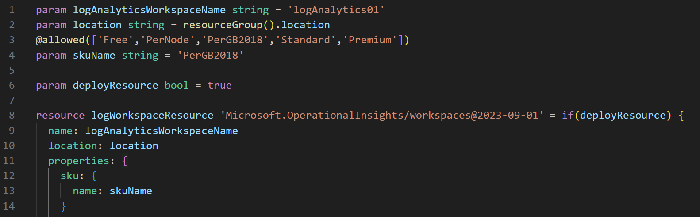
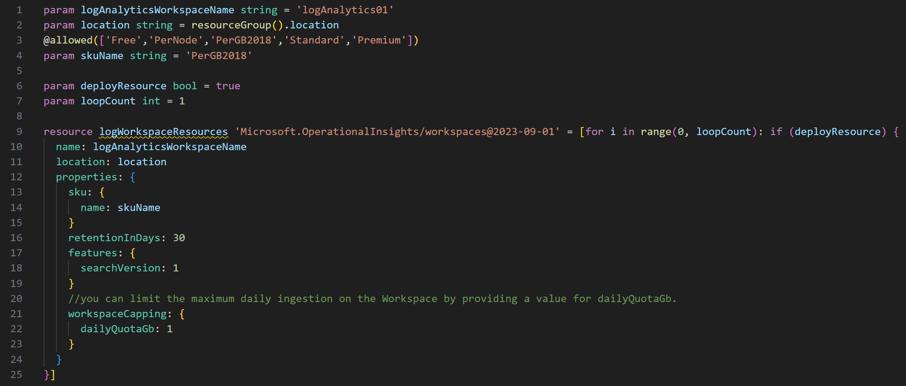
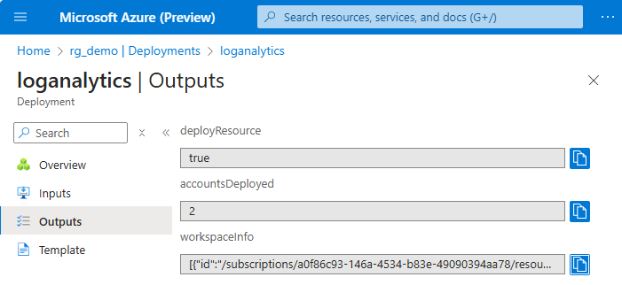

# Bicep Lab 4: Using Conditions and Loops in a Bicep Template

## Add a Conditional Parameter

Let's add a conditional parameter to the deploy to optionally deploy the workspace account.

Add the following parameter to the loganalytics.bicep file:

``` bicep
param deployResource bool = true
```

Then modify the resource statement on line 11 to replacing end of the line:

` = {` 

with this:

` = if(deployResource) {`

Your Bicep file should now looks like this:



Try deploying the file with the `deployResource` parameter set to false, so it will NOT deploy a resource:

``` bash
$resourceGroupName="rg_demo"
az deployment group create `
 --resource-group $resourceGroupName `
 --template-file loganalytics.bicep `
 --parameters deployResource=false
```

Then deploy it again taking the defaults, which would deploy an actual resource:

``` bash
az deployment group create `
 --resource-group $resourceGroupName `
 --template-file loganalytics.bicep
```

---

## Deploying in a loop

Now let's see how we can deploy more than one resource in a loop.

Add the following parameter to the loganalytics.bicep file:

``` bicep
param loopCount int = 1
```

Then modify the resource statement on line 11 to replacing end of the line:

` = if(deployResource) {`

with this:

` = [for i in range(0, loopCount): if (deployResource) {`

You will notice that the closing bracket is missing.  Add it at the end of the file, after the final closing curly brace.

Your Bicep file should now looks like this:



You should see a yellow squiggly line under the resource name.  This is because each resource name must be unique and we are not currently doing that.  Let's fix that by adding the loop index to the resource name.  Modify the resource name on line 10 to look like this:

``` bicep
  name: '${i}logAnalytics${uniqueString(resourceGroup().id)}'
```

In this case we are using the index to prefix the name of the resource, and then using a `uniqueString` function to create a really unique name.

### Bicep Outputs

In most cases we will want to include some output parameters in our Bicep templates.  This is done by adding `output` blocks to the end of the file. Typically, for each resource that is created, you will output the id and name, so that it can be used in future steps in your deploys.  

We can also use the same looping logic to create multiple outputs in a JSON array.  You can see in the following block examples of simple output parameters and a looping output parameter.  

Add the following output block to the end of the file:

``` bicep
output deployResource bool = deployResource
output accountsDeployed int = loopCount
output workspaceInfo array = [for i in range(0, loopCount): {
  id: logWorkspaceResources[i].id
  name: logWorkspaceResources[i].name
  sku: logWorkspaceResources[i].properties.sku.name
}]
```

Let's deploy this and create TWO resources by overriding the default loop count:

``` bash
az deployment group create `
 --resource-group $resourceGroupName `
 --template-file loganalytics.bicep `
 --parameters loopCount=2
```

Once your deploy has finished, review your resources in Azure to ensure that the new workspace was created as expected.

You can see your outputs in the command line window, but you can also view these outputs in the portal To view your outputs from your Bicep deploy, go to the Resource Group in the Azure Portal and click on the Settings -> Deployments menu item and find your deploy and click on that.  You will see a tab for Outputs that will show you the values of the outputs.



<!-- ------------------------------------------------------------------------------------------ -->
---

This completes this lab.

[Next Lab](../05_Migrate_to_Bicep/readme.md) | [Previous Lab](../03_Parameters/readme.md) | [Table of Contents](./readme.md)
