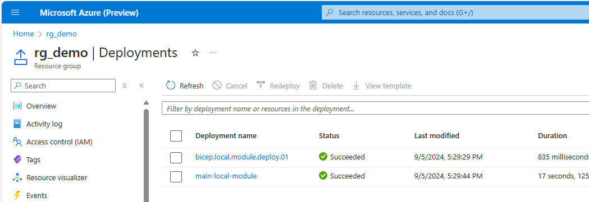
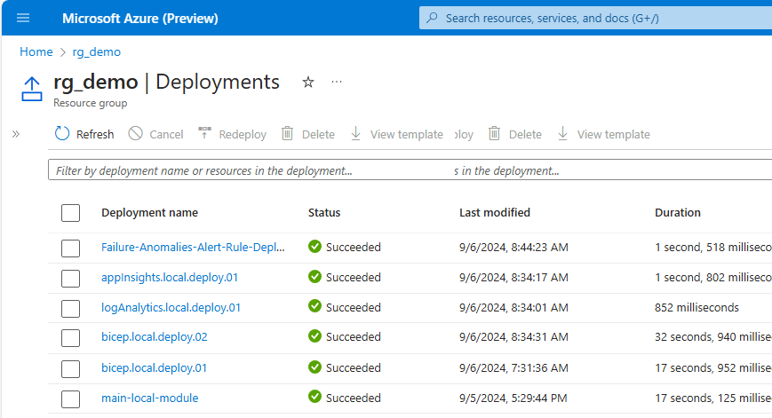
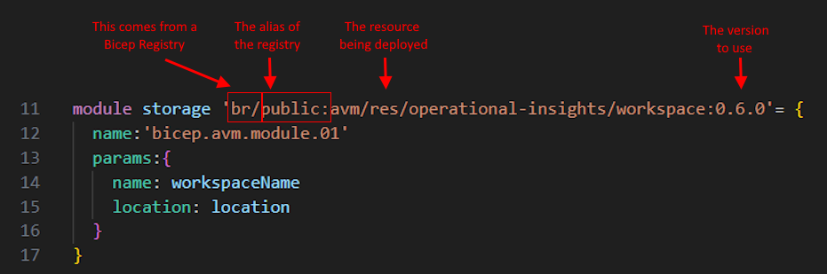
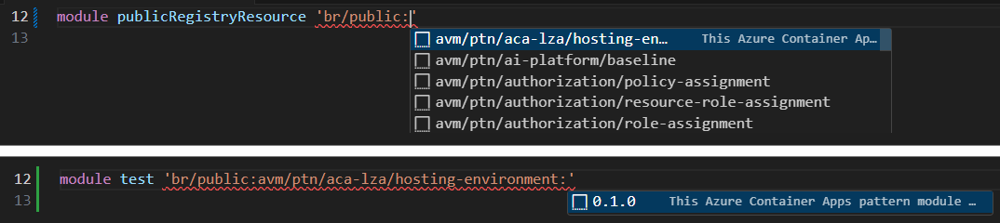
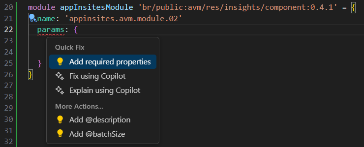
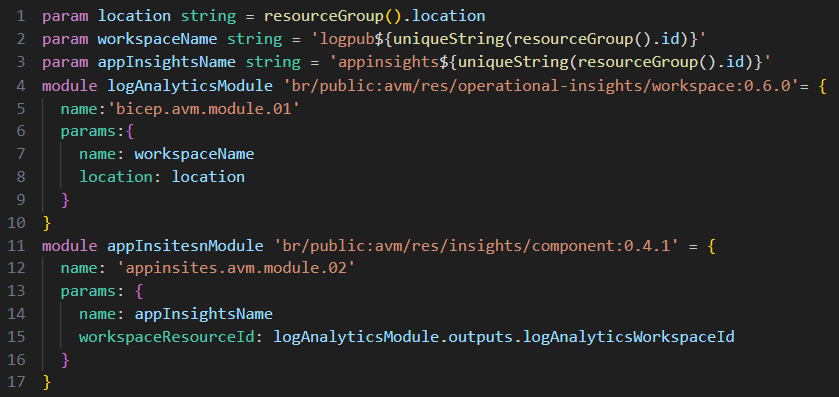

# Bicep Lab 6 - Using Modules in a Bicep Template

## Calling a Local Bicep module

The `logAnalytics.bicep` file in this folder is the same exact format that we have been using in previous labs, and we have experimented with encapsulating some of the parameters to make it reusable. As we've defined resources, we've used the `resource` keyword to define the them.

In this lab we will re-use that file as a module, and include it in another bicep.bicep file, but when doing so, we will now reference that file using the `module` keyword.

To begin this lab, open the Terminal and change the directory to the one where the Bicep file is located, using a command similar to the following:

``` bash
cd ..\06_Modules\
```

Open the main-local-module.bicep file in this folder and look at the contents.  At the bottom of the file insert this new block of code.

``` bicep
module logAnalyticsModule 'loganalytics.bicep' = {  
  name: 'logAnalytics.local.deploy.01'
  params:{
    workspaceName: logAnalyticsName
    location:location
    skuName: logAnalyticsSKU
  }
}

```

A couple of thoughts on this code:

### Intellisense in VS Code Bicep

Note that if you change the name `loganalytics.bicep` to something else like `bogus.bicep`, VS Code will see that as invalid and will underline it in red.  This is because it is looking for a file with that name in the same folder as the main.bicep file.  You can include paths in the module name (like `modules/loganalytics.bicep`), but we will not be doing that in this particular lab.

### Deployment Names

The word right after the `module` (in this case 'logAnalyticsModule') will be the name of this resource in the context of this particular bicep file. You will use that if you want to reference this resource in other parts of this Bicep file.

Each `module` deploy will create a separate child deployment in the Deployments section of your Azure Resource Group, and the `name` parameter will be the deployment name. If you use the static name (which is the same every time you deploy), it will overwrite the previous deployment history.  If you want to keep an easily accessible history of the previous deployment, you will need to change the name parameter by adding something unique, (like appending a date suffix).

In addition, when you deploy a Bicep file using the `az deployment group create` command, you can pass in a --name parameter, and it will use that as the name of the parent deployment in the Azure Resource Group.  If you do not pass in a --name parameter, it will use the name of the Bicep file as the name of the parent deployment.

### Deploy using defaults

Let's go ahead and deploy this file using the defaults as we've done in the previous lab:

``` bash
$resourceGroupName="rg_demo"
az deployment group create `
 --resource-group $resourceGroupName `
 --template-file main-local-module.bicep
```

Jump over to the Azure portal and look at the resources in the rg_demo resource group.  You should see a new Log Analytics Workspace that was created by the module.  If you click on the Settings -> Deployments menu and you should see something like this:



### Deploy using a .bicepparam file

Now let's deploy this file again using a parameter file and also a `--name` parameter to give more definitions. Feel free to edit the `main-local-module.bicepparams` file to change the name of the resource.

``` bash
az deployment group create `
 --name bicep.local.deploy.01 `
 --resource-group $resourceGroupName `
 --template-file main-local-module.bicep `
 --parameters main-local-module.bicepparam
```

## Using a Resource in another Resource

Some resources are dependent on other resources.  For instance, if you create an Application Insights resource, it needs to have a Log Analytics Workspace resource to hold it's data.  In the `main-local-module.bicep` file, we created a Log Analytics Workspace resource and named it `logAnalyticsModule`.  Let's create an App Insights resource and use the Log Analytics Workspace as an input.  

Add this code in the `main-local-module.bicep` after the `logAnalyticsModule` module definition:

``` bicep
module appInsightsModule 'appinsights.bicep' = {  
  name: 'appInsights.local.deploy.01'
  params:{
    appInsightsName: appInsightsName
    location:location
    workspaceId: 
  }
}

```

This fragment is intentionally incomplete.  Put your cursor after the `workspaceId:` and press `Ctrl+Space` to see the available parameters.  You should see `logAnalyticsModule` in the list - select that, then type `.` and you should see `outputs`. Select that and type `.` again and you should see the two output parameters defined in the Log Analytics Workspace module that we can use in this module.  This is how we can pass information between two modules. When you are done, it should look like this:

``` bicep
module appInsightsModule 'appinsights.bicep' = {  
  name: 'appInsights.local.deploy.01'
  params:{
    appInsightsName: appInsightsName
    location:location
    workspaceId: logAnalyticsModule.outputs.id
  }
}
```

### Implicit vs. Explicit Dependencies

We have created here what is referred to as an implicit dependency.  This means that the App Insights resource will not be created until the Log Analytics Workspace resource is created, because the App Insights resource is now dependent on the Log Analytics Workspace resource outputs.  If the Log Analytics Workspace resource fails to create, the App Insights resource will not be created either, which prevents orphaned resources from being created.

If you want to define an `Explicit Dependency`, you can add a `dependsOn` keyword to the resource definition.  This is not needed in most cases, but it is available if you find a reason to use it.

### Add the new parameter to the main.bicep file

To make this work, you will also need to add a parameter for `appInsightsName` to the main bicep file and to the bicepparam file.  

Add this line to the parameters section of the `main-local-module.bicep` file:

``` bicep
@description('Application Insights Name')
param appInsightsName string = 'appinsights${uniqueString(resourceGroup().id)}'
```

Add this line at the bottom of the `main-local-module.bicepparam` file:

``` bicep
param appInsightsName = 'appinsightslocal01'
```

### Deploy once more

Let's deploy this file again using the same command as last time, except a slightly different --name parameter:

``` bash
az deployment group create `
 --name bicep.local.deploy.02 `
 --resource-group $resourceGroupName `
 --template-file main-local-module.bicep `
 --parameters main-local-module.bicepparam
 
```

Go to the Azure portal and look at the resources in the rg_demo resource group.  You should see a new App Insights resource that was created by the module.  If you click on the Settings -> Deployments menu and you should see something like this:



You've started the first step in creating re-usable Bicep templates! There are several ways of sharing Bicep resources, but this is one of the simplest and most common ways to do it.

---

## Calling a PUBLIC module

So far in this lab, we have been including modules that we have defined in our own repo. We can also include modules from other public or private Bicep repositories. There are publicly defined modules that are published and maintained by Microsoft, and are very complete and comprehensive.  VS Code and the Bicep extension make this very simple by including syntax right in the editor that allows you to browse and use these public modules. You can view these modules by browsing to [https://github.com/Azure/bicep-registry-modules/](https://github.com/Azure/bicep-registry-modules/). The actual modules are listed in the avm/res folder in the repo.

You can reference an external Bicep Registry in your code by starting your resource reference with `br/`, followed by the name of the registry, the name of the resource, and the version, like this:



Once again, Intellisense in VS Code makes this simple.  If you type `br/` and then press `Ctrl+Space`, you will see a list of available registries.  If you select the `public` repo and press TAB, you will see a list of available modules in that registry.  If you select one of those modules by pressing TAB, you will see a list of available versions for that module.



Another helpful tip when you are working on modules is to start with the `name` and an empty `params` field. Put your cursor in the empty `params` field with red squigglies and press `Ctrl + .` and select `Add required properties`. This will tell you which fields that you need to enter in order to make the module work. There maybe other additional fields that you may want to enter, but at least you will have the required fields.



Update the main-public-module.bicep to call and use PUBLIC modules.  The module for logAnalytics is 'avm/res/operational-insights/workspace', and the module for application insights is 'avm/res/insights/component'.  Your code should look like this when it's done:



Deploy the newly defined Bicep file using the following command with the same parameters file as before:

``` bash
az deployment group create `
 --name bicep.public.deploy.02 `
 --resource-group $resourceGroupName `
 --template-file main-public-module.bicep `
 --parameters main-public-module.bicepparam

```

---

This completes this lab.

[Next Lab](../07_Bicep_Registries/readme.md) | [Previous Lab](../05_Migrate_to_Bicep/readme.md) | [Table of Contents](../readme.md#bicep-labs)
