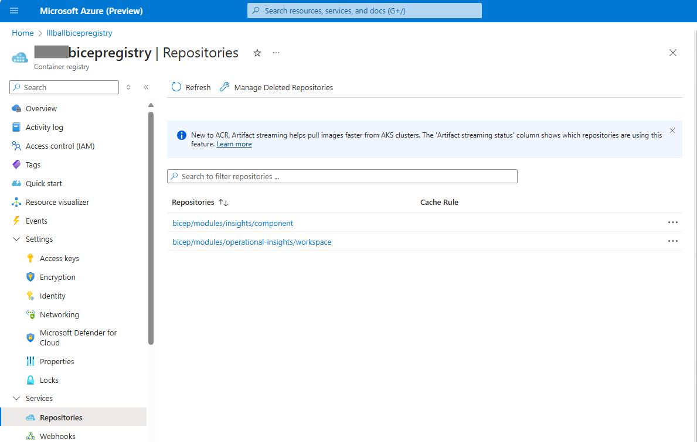

# Bicep Lab 7 - Using Bicep Modules from a Remote Registry

In this lab we will walk through the process of creating our own private registry and then deploying modules using the modules from that registry.

## Create your own Azure Container Registry

Run the following command to provision an Azure Container Registry in your subscription.  Be sure to replace `yourRegistryName` with a unique name for your registry, as it must be a globally unique name, something like `XXXbicepregistry`, where XXX are your initials.

```bash
$resourceGroupName="rg_demo"
az deployment group create `
 --resource-group $resourceGroupName `
 --template-file containerregistry.bicep `
 --parameters name=yourRegistryName
```

Review the resource in the Azure portal and then proceed to the next step.

---

## Publish A Module into the Registry

Now that we have a registry configured, we can publish a module into it.  We will use the storage-module.bicep file from the previous lab.  Run the following command to publish the module into the registry.

In this example we're using some variables to make it easier to change the name of the module and the version.

- Be sure to replace `XXXbicepregistry` with the name of your registry.
- We can give this any version we want, but for now we'll use `v1.0.0`.
- The `--target` parameter is the path to the module in the registry.  We can also give this any folder and object name we want, and in this case we will try to match what is in the public registry path for Log Analytics workspaces and Application Insights.

``` bash
$registryName="xxxbicepregistry"
$modulePath="bicep/modules"
$moduleVersion="v1.0.0"
$logAnalyticsModulePath="operational-insights/workspace"
$appInsightsModulePath="insights/component"
$delimiter=":"
az bicep publish `
  --file loganalytics.bicep `
  --target br:$registryName.azurecr.io/$modulePath/$logAnalyticsModulePath$delimiter$moduleVersion
az bicep publish `
  --file appinsights.bicep `
  --target br:$registryName.azurecr.io/$modulePath/$appInsightsModulePath$delimiter$moduleVersion

```

Navigate in the portal to your registry and go down the Services -> Repositories menu to see the modules you just published.



---

## Modify local bicepconfig.json to point to the Registry

Open the bicepConfig.json file in the root of the repository and modify the `registry` parameter to match what you just deployed on line 5.  The `alias` on line 4 can be whatever you want, it will just have to match what you use in the next steps.  For now, just leave it as `mybicepregistry`.


---

## Modify a Main Bicep template to deploy the modules

Now that we have the modules in the registry and our bicepconfig.json points to it, we can use them in a main template.  We will use the main.bicep file similar to the previous lab.  Open the `main-private-module.bicep` file and modify the `name` value to match the the location that you just published to.

If you put your cursor in the name field and type `br/` you should see the alias that you defined in the bicepConfig.json file pop up.  Once you pick that alias, you will need to enter in the path to the module in the registry. The bicepConfig.json defines the `bicep/modules` path for you, so we don't need to enter that. Follow up the alias of the registry with the module path that you used in the command above where you published then in the steps above, which would be `operational-insights/workspace` or `insights/component`, then a `:` and the version you published, which should be `v1.0.0`.


When you are done, your module references should look something like the following.  They may appear with red squigglies for a moment, but once the bicep process searches and finds the modules in the registry, they should go away.

``` bicep
module logAnalyticsModule 'br/mybicepregistry:operational-insights/workspace:v1.0.0' = {
module appInsitesModule 'br/mybicepregistry:insights/component:v1.0.0' = {
```

Now we can deploy from our private registry in the exact same way we did from the public registry in the previous lab.  Run the following command to deploy the main-private-module.bicep file:

``` bash
az deployment group create `
 --name bicep.private.deploy.01 `
 --resource-group $resourceGroupName `
 --template-file main-private-module.bicep `
 --parameters main-private-module.bicepparam

```

When it completes, review your resources in the portal and you should see the Log Analytics Workspace and Application Insights resources that were created by the modules.

<!-- ------------------------------------------------------------------------------------------ -->
---

To learn more about how to setup an automated CI/CD publishing routine for pushing Bicep files into the ACR each time the source changes, see: [this document](./automation/readme.md).

---

This completes this lab.

[Next Lab](../08_Deploy_Targets/readme.md) | [Previous Lab](../06_Modules/readme.md) | [Table of Contents](./readme.md)
