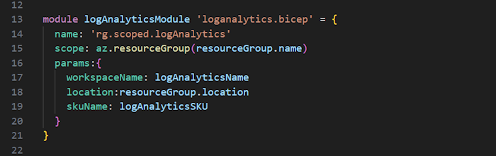

# Bicep Lab 8 - Deploy resources to subscriptions, management groups and Tenants

Up to this point, we have been deploying everything directly into a resource group. But what if we wanted to deploy at another level, like create a NEW resource group? Or deploy to a subscription, management group or tenant?

## Using Scope in your deploys

In order to deploy at a subscription level, you do need to have the correct permissions. Therefore for this lab, we will be examining the Bicep, but will not be actually deploying it.

If you look at the following example, you will see on line 6 that the `targetScope` is set to `subscription`. This means that by default all of the resources will be created at the subscription level, including the resource group on line 8. Note that the location is different than the `resourceGroup().location` value that we have used in previous examples.  Since we are creating the Resource Group, we have to supply the actual location for the Resource Group.

If you want to deploy a specific resource at the resource group level, you must set the `scope` property on the resource. In this case, we can revert back to using the `resourceGroup.location` property value for location.  This is shown in the following example:

## Additional MS Learn Lab Guides to Review

If you want to learn more about deploying resources to different scopes, check out the following MS Learn Labs:

Deploy a subscription-scoped resource:
[https://learn.microsoft.com/en-us/training/modules/deploy-resources-scopes-bicep/4-exercise-deploy-subscription-scoped-resource](https://learn.microsoft.com/en-us/training/modules/deploy-resources-scopes-bicep/4-exercise-deploy-subscription-scoped-resource)

Deploy resources to multiple scopes by using modules:
[https://learn.microsoft.com/en-us/training/modules/deploy-resources-scopes-bicep/6-exercise-deploy-multiple-scopes-modules](https://learn.microsoft.com/en-us/training/modules/deploy-resources-scopes-bicep/6-exercise-deploy-multiple-scopes-modules)

Deploying to a Management Group:
[https://docs.microsoft.com/en-us/learn/modules/deploy-resources-scopes-bicep/7-exercise-deploy-management-group](https://docs.microsoft.com/en-us/learn/modules/deploy-resources-scopes-bicep/7-exercise-deploy-management-group)

---

This completes this lab.

[Next Lab](../09_Tips/readme.md) | [Previous Lab](../07_Bicep_Registries/readme.md) | [Table of Contents](../readme.md#bicep-labs)
