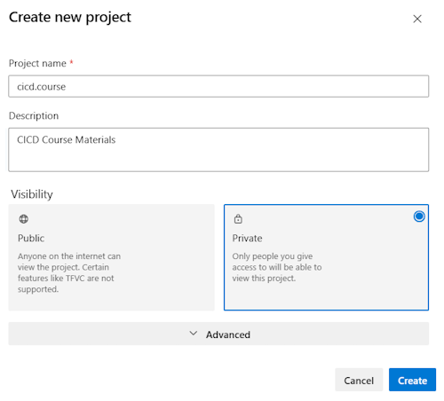
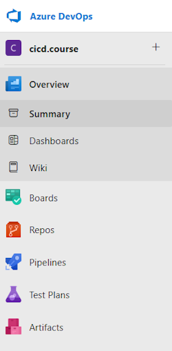
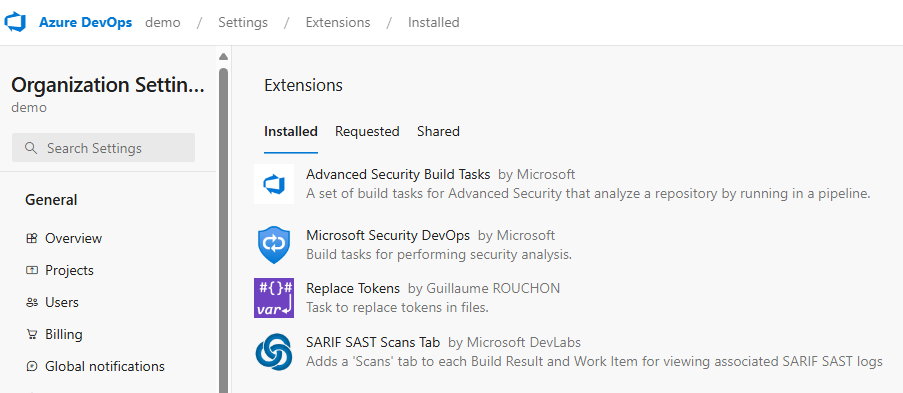

# Before you start

## What is needed?

* Azure DevOps Organization
* Azure Subscription

## Prepare your Azure DevOps (ADO) Organization

### Create a new ADO Organization

Goto [dev.azure.com](http://dev.azure.com) and sign in with your credentials. If you don't already have a DevOps organization you can use for testing create a "New organization" by clicking on "New organization" link on the lower left side of the page.

Now we have a new Organization in Azure DevOps and we can continue with creating a new project.

### Create a new ADO Project

Within your new ADO organization you can create one or more Projects.

Projects can have different levels of visibility:

* Public - Anyone on the internet can view the project.
* Enterprise - Member of your enterprise can view the project.
* Private - Only people you give access to will be able to view this project.

For this training specify a name, select "Private" and click on "+ Create project".

After a few seconds you should see your new project in Azure DevOps:

---

If you want to run all of the examples in this lab, you should install the following extensions in your Organization (you will need to be an organization administrator to do this).  Go to the Organization settings and select Extensions.  Then search for the following extensions in the MarketPlace and install them:

Links to the extensions:

* [Advanced Security Build Tasks](https://marketplace.visualstudio.com/items?itemName=ms.advancedsecurity-tasks&targetId=878bf5ce-b484-4cf6-90a2-aa4a84de88e3&utm_source=vstsproduct&utm_medium=ExtHubManageList)

* [Microsoft Security DevOps](https://marketplace.visualstudio.com/items?itemName=ms-securitydevops.microsoft-security-devops-azdevops&targetId=878bf5ce-b484-4cf6-90a2-aa4a84de88e3&utm_source=vstsproduct&utm_medium=ExtHubManageList)

* [SARIF SAST Scans Tab](https://marketplace.visualstudio.com/items?itemName=sariftools.scans&targetId=2dc64d21-d78c-495f-a4c1-d304d7437c3d&utm_source=vstsproduct&utm_medium=ExtHubManageList)

* [Replace Tokens](https://marketplace.visualstudio.com/items?itemName=qetza.replacetokens&targetId=878bf5ce-b484-4cf6-90a2-aa4a84de88e3&utm_source=vstsproduct&utm_medium=ExtHubManageList)

---

We are now done with the preparation for our lab.

<!-- ------------------------------------------------------------------------------------------ -->

---

[Begin First Lab](../yml/01_Starter/readme.md) | [Create a Custom Build Agent](../build-agents/desktop-runner/readme.md) | [VS Code Install](../setup/3-Visual-Studio-Code.md) | [Table of Contents](../../readme.md)
