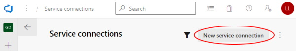

# Create Azure DevOps Service Connections

To enable Azure DevOps pipelines to run against a GitHub repository, both GitHub Service Connection and an Azure Subscription Service Connection need to be set up.

---

## Azure Service Connection

**Step 1:** Go to the project settings page:

**Step 2:** Select Service Connections:

**Step 3:** Add new Service Connection:

**Step 4:** Select Azure Resource Manager

### If you HAVE rights to create a Service Principal:

**Step 5:** The best option is to select the Workflow Identity Federation option. This option allows you to automatically create a new service principal with the necessary permissions. This is the recommended option because it is the most secure and it does not have secrets that expire. In addition, the service principal is automatically deleted when the service connection is deleted.

**Step 6:** Select a subscription and you will be prompted to authenticate to that subscription.  If you want to restrict this connection to a specific resource group, you can specify that here. Otherwise leave it blank and the connection will be able to create and/or use any resource group in the subscription.

Give the service connection a name that you will use in your pipelines. The default value for the class examples is "Demo Service Connection". If you use that value, you will not need to change the pipeline YML files.

If you executed steps 5 and 6, then skip steps 7 and 8.

### If you do NOT have rights to create a Service Principal:

If you don't have a rights to create a service principal, you can use the `Service principal (manual)` option. This option requires someone else to create the service principal for you and to provide you with the Service Principal Client Id, Tenant Id, and Client Secret.

**Step 7:** Select the Service principal (manual) option.

**Step 8:** For this step, things that are needed include the Azure Subscription name and Id, the Azure AD Service Principal Client Id and Tenant Id, and the Client Secret that was provided to you.  In addition, this service connection will need to be given the Contributor role on the subscription.

---

## References:

For more information, see: [https://docs.microsoft.com/en-us/azure/devops/pipelines/library/service-endpoints](https://docs.microsoft.com/en-us/azure/devops/pipelines/library/service-endpoints)
