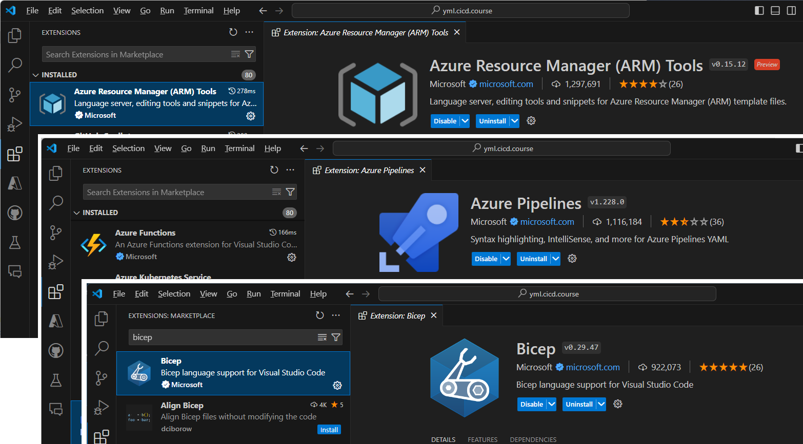
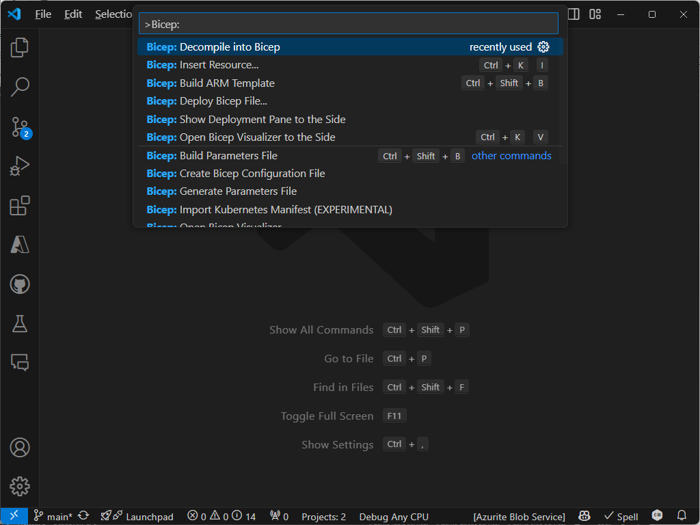

# PreReqs: Installing and Configuring Visual Studio Code and Other Required Tools

## Steps

1. You will need Admin privileges on local machine to install CLI tools such as Azure CLI and Bicep

1. [Install Git](https://github.com/git-guides/install-git)

1. [Install Azure CLI](https://learn.microsoft.com/en-us/cli/azure/install-azure-cli)

1. [Install Bicep Tools](https://learn.microsoft.com/en-us/azure/azure-resource-manager/bicep/install)

1. [Install AZ PowerShell Modules](https://learn.microsoft.com/en-us/powershell/azure/install-azure-powershell)

1. Install [Visual Studio Code](https://code.visualstudio.com/download)

1. Install VS Code Extensions:
   - [Bicep](https://marketplace.visualstudio.com/items?itemName=ms-azuretools.vscode-bicep)

   - [Azure Resource Manager (ARM) Tools](https://marketplace.visualstudio.com/items?itemName=msazurermtools.azurerm-vscode-tools)

   - [Azure Tools](https://marketplace.visualstudio.com/items?itemName=ms-vscode.vscode-node-azure-pack)

   - [Azure Pipelines for VS Code](https://marketplace.visualstudio.com/items?itemName=ms-azure-devops.azure-pipelines)

   

---

## Test your installs

To verify your AZ CLI installation, run this command in your terminal or command prompt:

``` bash
az --version
```

To validate your Bicep CLI installation, run this command in your terminal or command prompt:

``` bash
az bicep version
```

To upgrade to the latest Bicep version, run this command in your terminal or command prompt:

``` bash
az bicep upgrade
```

To verify your VS Code Bicep extension is working:

- Open the VS Code Command Pallette with Ctrl+Shift-P or F1 (on Windows)
- Type `Bicep:` and you should see a list of Bicep commands

  

Some other useful extensions you might want to install for Infrastructure as Code development:
  
  

> Note: make sure to get the extensions from Microsoft with the verified domain (the blue star icon) as there will be lots of other extensions with similar names!

<!-- ------------------------------------------------------------------------------------------ -->

This completes this lab.
