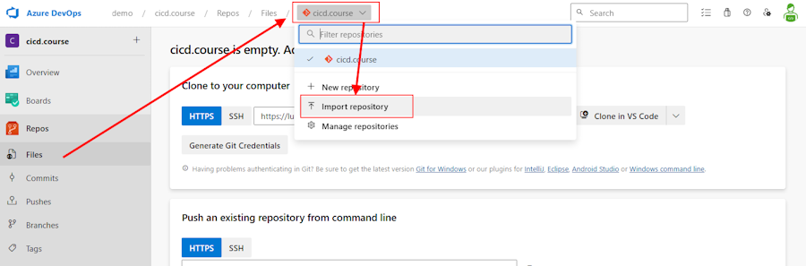

# Setting up Your Workspace

## Exercise: Import our Repository from GitHub

Before we can start working on our first pipeline, we need a Repository in Azure DevOps.

> **What are Azure Repos?**  
> Azure Repos are a set of version control tools that you can use to manage your code. Whether your software project is large or small, using version control as soon as possible is a good idea.
> Version control systems are software that help you track changes you make in your code over time. As you edit your code, you tell the version control system to take a snapshot of your files. The version control system saves that snapshot permanently so you can recall it later if you need it. Use version control to save your work and coordinate code changes across your team.  Goto [learn.microsoft.com/en-us/azure/devops/repos/get-started](https://learn.microsoft.com/en-us/azure/devops/repos/get-started/what-is-repos) to learn more.

1. To initialize the default repository in our DevOps Project, click on **Repos** -> **Files** and select **Import a repository**

    

1. We will start this class by importing a repository from GitHub. Since we may have many students using the same project, make sure to change the destination repository name to include your name.  This will help you keep your work separate from other students:

    

    **Settings:**

    * Repository type: Git
    * Clone URL: `https://github.com/lluppesms/activate.cicd.course.git`
    * Name: YOUR-NAME-HERE.cicd.course

1. And click on "Import".

    

This will now import the whole public Repository from GitHub into your new Azure DevOps Repository.  We will use some of those components in the following labs.

## Exercise: Open your workspace in Visual Studio Code

Now that we have a repository in Azure DevOps, let's open it in Visual Studio Code so you can start editing it.  Navigate in the Azure DevOps portal to the repository you just created and click on the `Clone` button, then select `Clone in Visual Studio Code`, click `Open` when prompted, choose a directory on your local machine to clone the repository to (note: this clone will create a subdirectory in the place you choose with the name of the repo), and click `Select as Repository Destination`. Once if finishes cloning in a few moments, click on `Open` to open the repository in Visual Studio Code and you should be ready to go.

---

<!-- ------------------------------------------------------------------------------------------ -->

You should be read to start your labs!

[Begin First Lab](../yml/01_Starter/readme.md) | [Create a Custom Build Agent](../build-agents/desktop-runner/readme.md) | [VS Code Install](../setup/3-Visual-Studio-Code.md)  | [Setup AzDO](../setup/1-Create-Azdo-Project.md) | [Table of Contents](../../readme.md)
