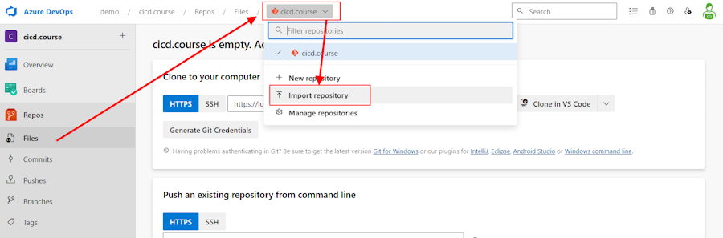
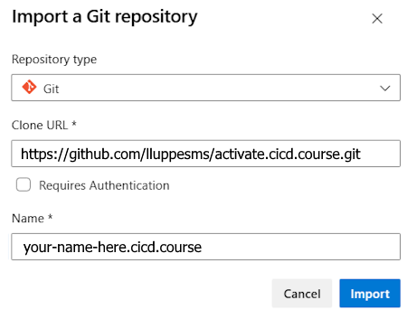

# Lab 1 - Introduction

In Lab 1 we are starting with an introduction into Pipelines-as-Code with Azure DevOps by building a first, basic Pipeline using the Azure DevOps Portal.

> If you have not created an Organization and a Project in Azure DevOps, please start with the preparation tasks in the [0.1 Create an Azure DevOps Project](./Create-Azdo-Project.md) guide.

> If you need a custom Build Agent and have not created a Build Agent yet, you can install a Build Agent on your VM or Local Machine.  Please follow the instructions in the [0.2 Create a Custom Build Agent](/Labs/Build-Agents/desktop-runner/readme.md) guide.

Exercises:

* [0.1 Create an Azure DevOps Project](../../setup/Create-Azdo-Project.md)
* [0.2 Create a Custom Build Agent](../../build-agents/desktop-runner/readme.md)
* [1.1 Import the repository](#exercise-import-our-repository-from-github)

---

## Exercise: Import our Repository from GitHub

Before we can start building our first pipeline, we need a Repository in Azure DevOps.

> **What are Azure Repos?**  
> Azure Repos are a set of version control tools that you can use to manage your code. Whether your software project is large or small, using version control as soon as possible is a good idea.
> Version control systems are software that help you track changes you make in your code over time. As you edit your code, you tell the version control system to take a snapshot of your files. The version control system saves that snapshot permanently so you can recall it later if you need it. Use version control to save your work and coordinate code changes across your team.  Goto [learn.microsoft.com/en-us/azure/devops/repos/get-started](https://learn.microsoft.com/en-us/azure/devops/repos/get-started/what-is-repos) to learn more.

1. To initialize the default repository in our DevOps Project, click on **Repos** -> **Files** and select **Import a repository**

    

1. We are now importing the Lab Repository from GitHub:

    

    **Settings:**

    * Repository type: Git
    * Clone URL: `https://github.com/lluppesms/activate.cicd.course.git`
    * Name: YOUR-NAME-HERE.cicd.course

1. And click on "Import".

    

This will now import the whole public Repository from GitHub into your new Azure DevOps Repository.  We will use some of those components in the following labs.
