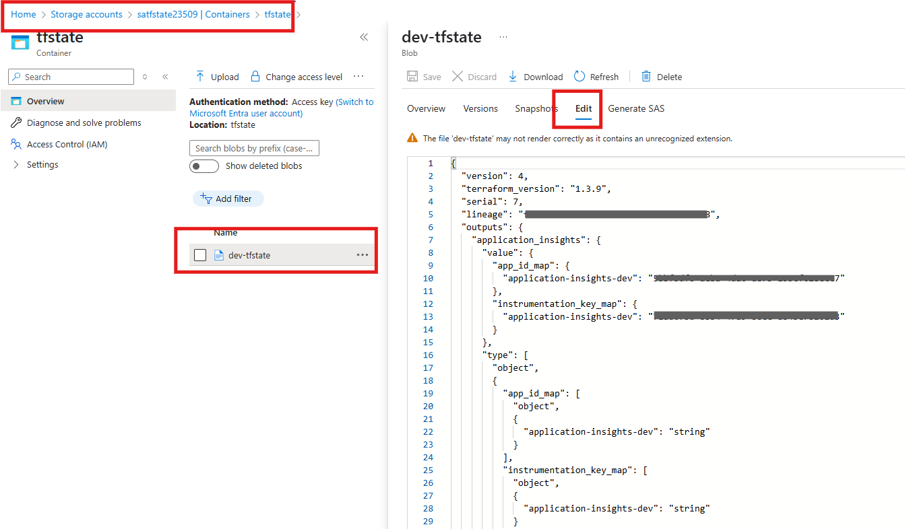
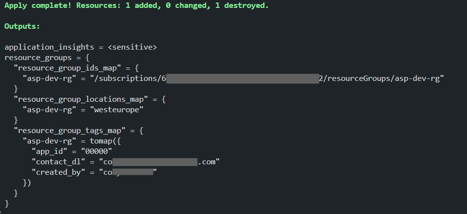

# Run Terraform Locally with a remote backend to keep Terraform State

References: [Terraform Remote State](https://developer.hashicorp.com/terraform/language/backend/remote#remote)

1. Review the dev.backend.tfbackend file in the ```dev-poc``` folder. Update its contents to match an Azure storage account, container, and state file (key) you want to store your remote state in

1. Run the bootstrap script to create the remote storage location for your backend in your Azure Subscription.

1. Uncomment line 10 in ```provider.tf``` 

    Re-initialize Terraform from the scripts folder specifying the proper backend:

    ``` bash
    terraform init -backend-config=../config/dev-poc/dev.backend.tfbackend```
    ```

    Run another terraform plan, this type specifying the configuration use the backend described in the ```dev.backend.tfbackend file```

    ``` bash
    terraform plan -var-file=../config/dev-poc/applicationinsights.auto.tfvars  -var-file=../config/dev-poc/appserviceplan.auto.tfvars -var-file=../config/dev-poc/parameters.auto.tfvars -var-file=../config/dev-poc/resourcegroups.auto.tfvars -out=tfplan -backend-config=../config/dev-poc/dev.backend.tfbackend
    ```

1. You should be prompted to import the local state to remote. Select 'yes'

    ``` bash
    Initializing the backend...
    Do you want to copy existing state to the new backend?
      Pre-existing state was found while migrating the previous "local" backend to the
      newly configured "azurerm" backend. No existing state was found in the newly
      configured "azurerm" backend. Do you want to copy this state to the new "azurerm"
      backend? Enter "yes" to copy and "no" to start with an empty state.

      Enter a value: yes


    Successfully configured the backend "azurerm"! Terraform will automatically
    use this backend unless the backend configuration changes.
    ```

    Review the Content of the state file in your Azure Storage Account Container
    

1. Run a Terraform Plan and view the results. Your output should look similar to this:

    ``` yml
      # module.app_insights.azurerm_application_insights.this["appinsight1"] must be replaced
    -/+ resource "azurerm_application_insights" "this" {
          ~ app_id                                = "79da5cfa-afc3-42cb-a087-a62888a6d157" -> (known after apply)
          ~ connection_string                     = (sensitive value)
          ~ daily_data_cap_in_gb                  = 100 -> (known after apply)
          ~ daily_data_cap_notifications_disabled = false -> (known after apply)
          ~ id                                    = "/subscriptions/6f3de85d-e9ff-4c65-abe6-78a3030f1a92/resourceGroups/asp-dev-rg/providers/Microsoft.Insights/components/application-insights-dev" -> (known after apply)
          ~ instrumentation_key                   = (sensitive value)
            name                                  = "application-insights-dev"
            tags                                  = {
                "app_id"     = "00000"
                "contact_dl" = "codycarlson@microsoft.com"
                "created_by" = "codycarlson"
                "env"        = "DEV"
                "iac"        = "Terraform"
            }
          - workspace_id                          = "/subscriptions/6f3de85d-e9ff-4c65-abe6-78a3030f1a92/resourceGroups/ai_application-insights-dev_79da5cfa-afc3-42cb-a087-a62888a6d157_managed/providers/Microsoft.OperationalInsights/workspaces/managed-application-insights-dev-ws" -> null # forces replacement     
            # (10 unchanged attributes hidden)
        }

    Plan: 1 to add, 0 to change, 1 to destroy.
    ```

---

**Question** Why is it trying to recreate the resource??  Can you answer that?

---

6. Run a Terraform Apply to update the configuration

    

---

At this point, we have now successfully connected used a state file in a remote source to configure our Terraform deploy! This completes this lab.

[Next Lab](./lab03.md) | [Previous Lab](./lab01.md) | [Table of Contents](../../readme.md)
