# YML Lab 4 - Triggers

Any DevOps lifecycle comprises of bunch of process that run at different stages of the lifecycle consuming and exposing data through various channels. Triggers enable customer to orchestrate the DevOps process in an efficient manner by automating the CI/CD process.

Triggers are events on which you can start your pipeline run automatically. You can enable triggers on your pipeline by subscribing to both internal and external events. An event can be completion of a process, availability of a resource, status update from a service or a timed event.

Lets have a look at how we would work with triggers.

Exercises:

* [4.1 Triggers and Branches](#exercise-41-working-with-triggers-and-branches)
* [4.2 Triggers and Paths](#exercise-42-working-with-triggers-and-paths)
* [4.3 Scheduled Triggers](#exercise-43-scheduled-triggers)
* [4.4 Pull Request Triggers](#exercise-44-pull-request-triggers)

<!-- ------------------------------------------------------------------------------------------ -->
---

## Exercise 4.1: Working with Triggers and Branches

> **Scenario**  
> I would like to trigger my pipeline when a commit is made to a certain branch.

First lets create a couple of branches to work with.

1. Goto Repos -> Branches
1. Click `New branch`
1. Give it a suitable name for example `team1/feature1`
1. Click `Create`
1. Similarly create another branch for example `team2/feature2`

    

    Once done your branches will look similar to the below

    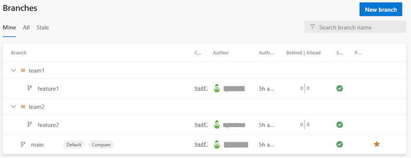

    Next lets create a new pipeline, this time from the repos.

1. Goto Repos > Files
1. Select one of the feature branch you created above for example **team1/feature1**

    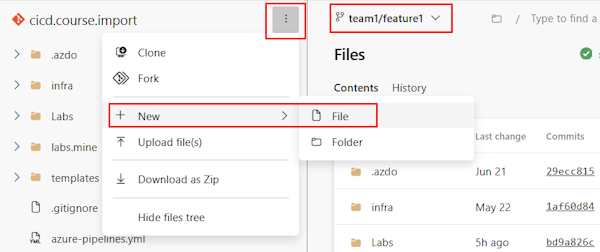

1. Give the file a suitable name like `working-with-triggers.yml`

    

1. Click `Create`
1. Copy paste the below content.

    ```yml
    trigger:
      branches:
        include:
        - team1/*
        exclude:
        - main
        - team2/*

    pool:
      vmImage: ubuntu-latest

    steps:
    - script: echo Hello, world!
      displayName: 'Run a one-line script'

    - script: |
        echo Add other tasks to build, test, and deploy your project.
        echo See https://aka.ms/yaml
      displayName: 'Run a multi-line script'
    ```

1. Click `Commit` twice.
1. Goto Pipelines -> Pipelines
1. Click `New Pipeline`
1. Select `Azure Repos Git (YAML)`
1. Select your repository
1. Select `Existing Azure Pipelines YAML file`
1. Select feature branch `team1/feature1` and path as `/working-with-triggers.yml`

    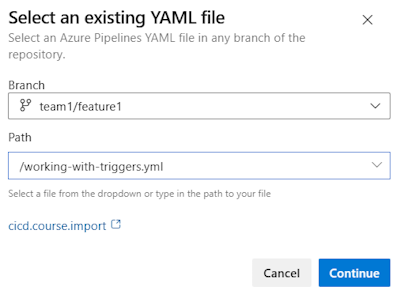
  
1. Click `Continue`

    Notice carefully that you are creating a trigger based on  changes made to a branch and including one branch and excluding two others.

1. We will not run the pipeline yet, instead from the drop click `Save`
  
    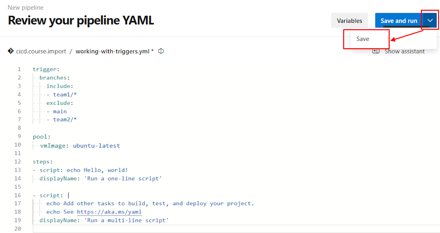

    We've now successfully imported a pipeline we've previously created directly in our Azure Repo. Before we proceed, let's rename our pipeline:

1. Go to Pipelines -> Pipelines
1. Click on `All` to view the pipeline we just created.

    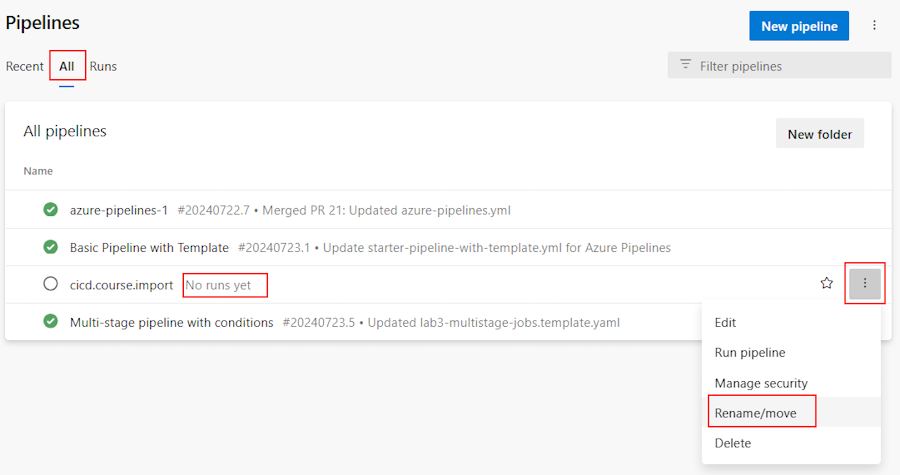

1. Click and rename the pipeline as done in the previous labs.
1. Give it a suitable name like for example `Working with triggers`
1. Click `Save`

    Next lets put this to action. Lets make a change to our code/content in branch **feature1**

1. Goto Repos > Files
1. Change the branch from `main` to `team1/feature1`

    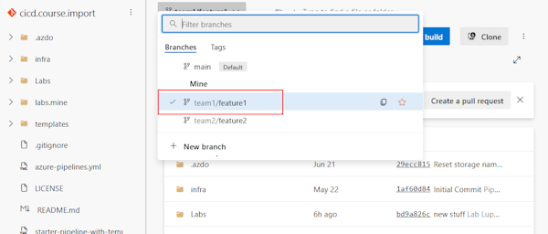

1. Click on the three dots next to the name of your repository and select **New** > **Folder**

    

1. Provide a name to the folder and also a file name. Click `Create`

    

1. Type some sample text on the ReadMe.md edit window
1. Click `Commit`
1. Click `Commit` again and make sure that you have the correct `branch name` selected.
1. Click on Pipelines -> Pipelines.

    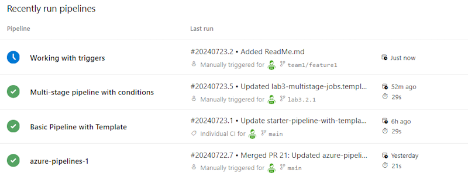

Notice how only one of the pipelines gets triggered based on our inclusion and exclusion rules and other pipelines remain as is.

<!-- ------------------------------------------------------------------------------------------ -->
---

## Exercise 4.2: Working with Triggers and Paths

> **Scenario**  
> I would like to trigger my pipeline only when a new commit happens in the path “Repository/Web/*”.

In this exercise we will see how we can make use of path based triggers to include/exclude certain files from triggering the pipeline. For example when you have docs in wiki, you would need to trigger the pipeline for changes you make to the document files.

Lets see this in action.

First lets modify the YAML pipeline.

1. Click Pipelines -> Pipelines
1. Select the `Working with triggers` pipeline
1. Click `Edit`
1. Replace the `trigger` section with the below code

    ```yml
    trigger:
      branches:
        include:
        - team1/*
        exclude:
        - main
        - team2/*
      paths:
        include:
        - docs/*
        exclude:
        - docs/sample-file.md
    ```

    Your pipeline should look like below:

    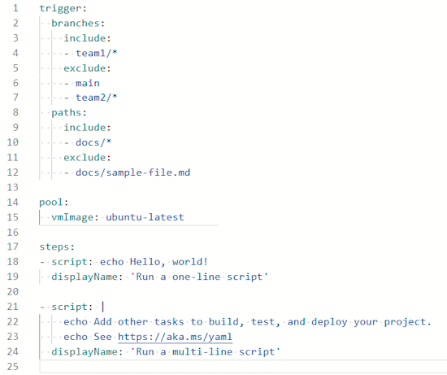

1. Click `Save` twice to commit to feature branch.

    Let's now create the folder structure to showcase what we did.

1. Go back to Repos > Files
1. Create a new folder called `docs` and a file called `readme.md`
1. Type some sample text and click on `Commit` twice.
1. Goto Pipelines -> Pipelines

    After this our pipeline is now triggered once as we've created a new folder called `docs` that will trigger the pipeline.

    Now lets put this logic into action. We are going to add and edit the `sample-file.md` which should not trigger the pipeline based on our path based exclusion.

1. Click on Repos > Files

    Make sure you are in the right branch which in our case is `team1/feature1`.

1. Create a new file called `sample-file.md` in our `docs` folder
1. Type some sample text and click on `Commit` twice.
1. Goto Pipelines -> Pipelines

    You will notice that the `Working with triggers` pipeline does not get triggered based on our exclusion.

1. Go back to Repos > Files and ensure the right branch (team1/feature1) is selected.
1. Create a new file under the docs folder, for example `sample-file02.md`. Click `Create`
1. Type some sample text and click `commit` twice.
1. Notice how the `Working with triggers` pipeline gets triggered.

<!-- ------------------------------------------------------------------------------------------ -->
---

## Exercise 4.3: Scheduled Triggers

> **Scenario**  
> I would like to trigger a pipeline on a recurring basis to scan my code.

Sometimes it makes sense to trigger pipelines based *not only* on a changed file - there are scenarios where you want to run a pipeline on a regular basis, like code scanning.

To implement this we have a `scheduled trigger` that allow us to run pipelines based on a specific schedule, very similar to a cronjob in Linux.

In this task we are now going to create a pipeline to run on a daily and a weekly basis.

1. Goto Pipelines -> Pipelines -> New pipeline
1. Select `Azure Repos Git (YAML)`
1. Select your repository
1. Select `Starter Pipeline`

Replace the code provided with the following:

```yml
trigger:
 - none
schedules:
- cron: '0 12 * * 3'
  displayName: Scan Every Wednesday
  branches:
    include:
    - main
pool:
  vmImage: ubuntu-latest
stages:
- stage: ScanApplication
  jobs:
  - template: /.azdo/pipelines/templates/scan-code-template.yml
```

The cron expression cron: `0 12 * * 3` schedules a task to run at 12:00 PM (noon) every Wednesday, regardless of the day of the month or the month itself, and this will run on the main branch whether the code has changed or not since the last run.

It is also possible to have multiple scheduled triggers in a single pipeline. We can for example add:

```yml
- cron: "0 12 * * 0"
  displayName: 'Weekly Sunday build'
  branches:
    include:
    - main
  always: true
```

This code will, on top of the previous trigger, run the pipeline every Sunday at 12am and run a build.

As we have specified only the `main` branch above, we have to merge our changes into main first before our scheduled trigger will start to work.

* Goto Repos > Pull Requests
* Create a new pull requests
* Merge changes from our current branch into main


* Enter a viable title and description
* Click on `Create`

In the next dialog you can review your pull request. When you have completed your review:

* Click on `Complete`

Now that our changes are in main, let us check the pipeline triggers.

* Goto Pipelines -> Pipelines
* Select our `Working with triggers` pipeline
* Goto `Triggers`

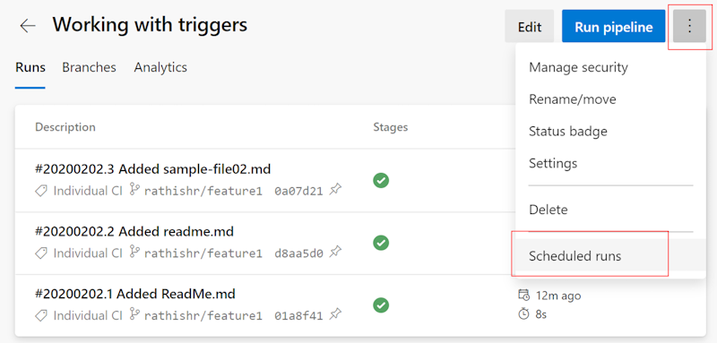

And this will show you the next scheduled pipeline runs, based on the scheduled triggers we have defined earlier:


If you want to actually see the pipeline run, you can click on the `Run pipeline` button.

> **Note:** To make this work, you must first enable the free `Microsoft Secure DevOps Scan` extension in your organization by installing it from the Azure DevOps Marketplace for your organization.  See [https://marketplace.visualstudio.com/items?itemName=ms-securitydevops.microsoft-security-devops-azdevops](https://marketplace.visualstudio.com/items?itemName=ms-securitydevops.microsoft-security-devops-azdevops). (You must be an Organization Admin in order to install extensions.)

<!-- ------------------------------------------------------------------------------------------ -->
---

## Exercise 4.4: Pull Request Triggers

> **Scenario**  
> I would like to trigger my pipeline to do a scan and a build whenever a pull request is created.

In this lab we will create a YML pipeline that will get kicked off whenever a PR is submitted and the results will be included as part of the PR.

Let's create a simple pipeline that will scan and build our code.

1. Goto Pipelines -> Pipelines -> New pipeline
1. Select `Azure Repos Git (YAML)`
1. Select your repository
1. Select `Starter Pipeline`

Replace the code provided with the following:

```yml
# ----------------------------------------------------------------------------------------------------
# Pipeline to scan/build an app upon Pull Request
# FYI -> Set a required branch policy to run this on every check-in to main 
# ----------------------------------------------------------------------------------------------------
trigger:
 - pr
pool:
  vmImage: ubuntu-latest

stages:
- stage: ScanApplication
  displayName: Scan Application
  jobs:
  - template: /.azdo/pipelines/templates/scan-code-template.yml

- stage: BuildApplication
  displayName: Build Application
  dependsOn: ScanApplication
  jobs:
  - template: /.azdo/pipelines/templates/build-code-template.yml
```

Click into the file name field and change the name of the file to be saved to `pr-scan-build.yml`, then click on the More options button and select `Save` and commit this to your main branch.

Once the file is saved, use the "More" option in the upper right to rename the pipeline to be `PR Scan and Build`.

> **Note**: To make this class run faster, this build job template actually DOES ALMOST NOTHING except copy some files.  In the real world, you would want to change this template to add some real compile and build steps.

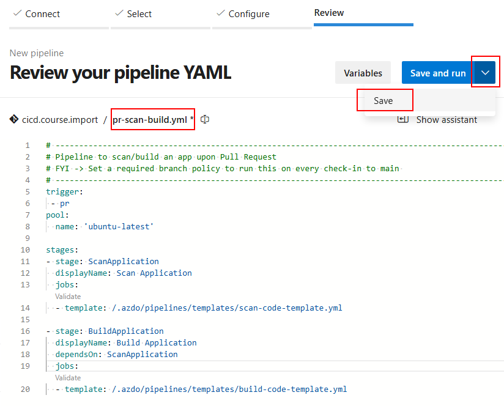

Next, in order to get this to run whenever a pull request is created, we have to create a branch policy.  Navigate to Repos -> Branches and select the main branch.  Click on the three dots and select `Branch policies`.


Find the Build Validation section and click on `+` to add a new build policy. Select the pipeline we just created, update the Display name, and click `Save`.


That's it!  Now let's create a PR and have the results show up in the PR.
First we will create a branch to work with.

1. Goto Repos -> Branches
1. Click `New branch`
1. Give it a suitable name for example `pr-test`
1. Click `Create`

    

Next we will edit a file in this branch and create a pull request.

1. Goto Repos > Files
1. Select one of the feature branch you created above for example **pr-test**
1. Click on a file like `readme.md` and then click on the `Edit` button.
1. Make a change to the file, then click on `Commit` and then `Commit` again.

You should see a prompt to create a new pull request.  Click on `Create pull request` then click on `Create`.
    

Once you've saved the PR, you should the pipeline being incorporated into the pull request as one of the requirements.
    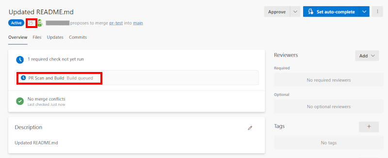

If you were to go over to the pipeline and view the details, you should be able to see that this pipeline was triggered by a PR.
    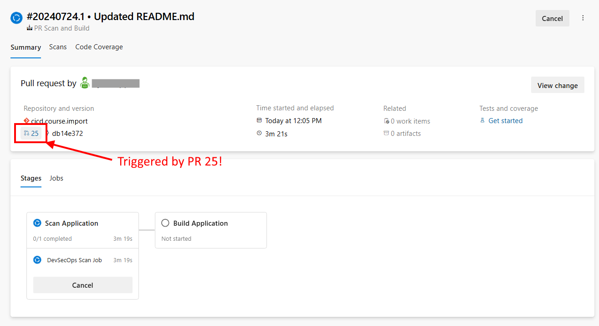

Once the pipeline has completed, you should see the results in the PR now!
    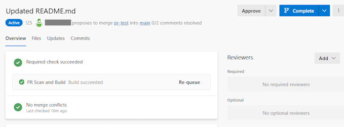

<!-- ------------------------------------------------------------------------------------------ -->
---

This completes Lab 4.

[Next Lab](../05_Variables/readme.md) | [Previous Lab](../03_Templates/readme.md) | [Table of Contents](../../readme.md)
