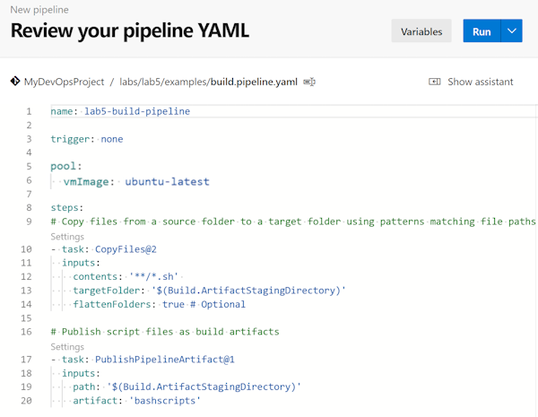
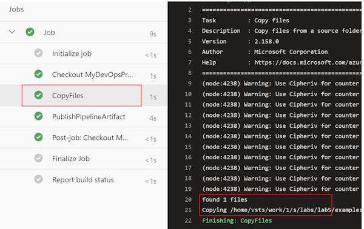
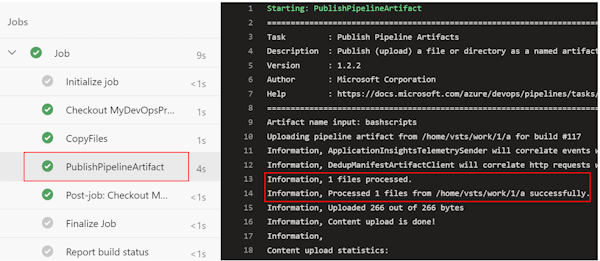
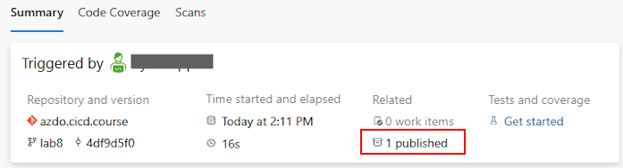
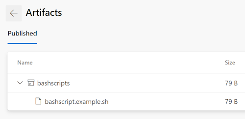
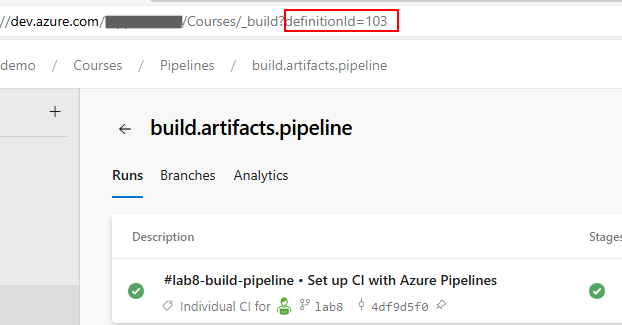
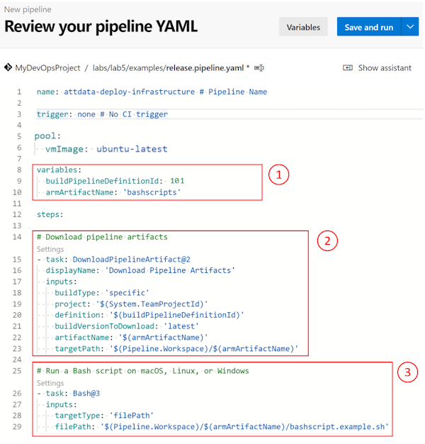
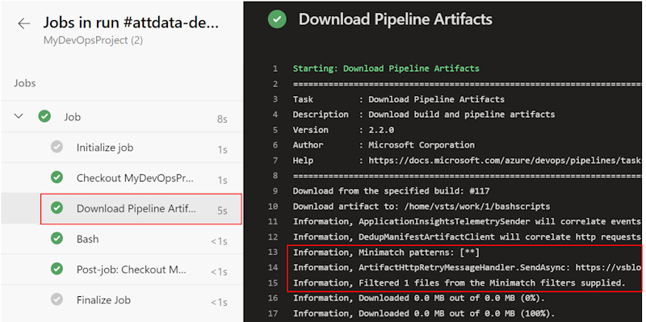
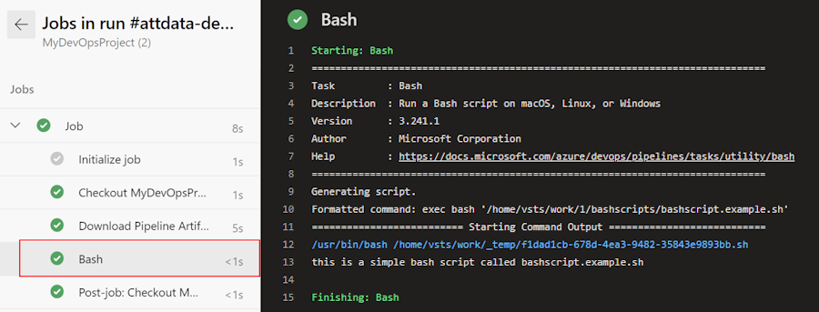

# YML Lab 8 - Splitting CI and CD

In this lab we are going to implement a build pipeline that creates versioned artifacts that can be used by multiple other release pipelines afterwards.

> You can publish and consume many different types of packages and artifacts with Azure Pipelines. Your continuous integration/continuous deployment (CI/CD) pipeline can publish specific package types to their respective package repositories (NuGet, npm, Python, and so on). Or you can use build artifacts and pipeline artifacts to help store build outputs and intermediate files between build steps. You can then add onto, build, test, or even deploy those artifacts. See [Artifacts Overview](https://learn.microsoft.com/azure/devops/pipelines/artifacts/artifacts-overview) to learn more.

Exercises:

* [8.1 Build Pipelines and Artifacts](#exercise-81-build-pipelines-and-artifacts)
* [8.2: Working with Build Artifacts](#exercise-82-working-with-build-artifacts)

---

## Exercise 8.1: Build Pipelines and Artifacts

Let's start with a build pipeline that creates and publishes build artifacts for us.

* Goto Repos > Branches
* Create a new branch "lab8" that is based on main
* Goto Pipelines > Pipelines
* Click on "New pipeline"
* Click on "Azure Repos Git (YAML)"
* Select our repository
* Select "Existing Azure Pipelines YAML file"
* Select the lab8 branch
* Select `/.azdo/pipelines/build.pipeline.yml`
* Click on "Continue"

You will now see a very simple build pipeline that does two things:

* Copy all files that end with *.sh (shell script)
* Publish these files as build artifacts

    

* Click on "Run"
* Click on "Job" to check the job details
* Check the "CopyFiles" task

    You will see that our CopyFiles task found 1 file and copied it into out staging directory.

    

* Next, check the "PublishPipelineArtifact" task

    You will see here that it has published 1 file. This is the file that was copied in the previous step.

    

With this we have now successfully created a build pipeline that takes a subset of files from our repository and publishes them as artifacts.

You can also find your build artifacts from within the Azure DevOps UI when you goto the pipeline run details:



You can click on it to see in details which files where published.



We will see in the next task how to work with these artifacts. 

Before we proceed, navigate back to the pipeline definition page and take a note of the `definitionId` of our build pipeline. We need to reference the `definitionId` of our build pipeline as part of our next task.



<!-- ------------------------------------------------------------------------------------------ -->
---

## Exercise 8.2: Working with Build Artifacts

In our previous task we have created a build pipeline that has copied a subset of files from a repository and published them as build artifacts.

We now want to consume these build artifacts to do something with them. Therefore we will now create a release pipeline.

* Goto Pipelines > Pipelines
* Click `New pipeline`
* Select `Azure Repos Git (YAML)`
* Select our repository
* Select `Existing Azure Pipelines YAML file`
* Select the correct branch (lab8)
* Select `/.azdo/pipelines/release.pipeline.yml`
* Click on "Continue"

You will now see the example release pipeline:



The pipeline contains three main areas.

1) Variables definition. We are specifying here the buildPipelineDefinitionId that contains the ID of our build pipeline (created in the previous task).

2) The `DownloadPipelineArtifact@2` task that is downloading our artifact that we have created in our build pipeline. There are more parameters to make this even more specific.

3) How to execute a script that comes from our artifact.

To finish up this pipeline, we update the `buildPipelineDefinitionId` with the definitionId from our previous task, so that it looks something like this:

``` yml
variables:
  buildPipelineDefinitionId: 123
  armArtifactName: 'bashscripts'
```

Save and run the pipeline and when it is finished check the output. In our job details, click on "Job" where we will find the `Download Pipeline Artifacts` task that downloaded the artifacts from a specific build pipeline:



And an example where we execute a script that is coming from our artifacts:



This separation can be useful in many ways.

* Single Build, multiple Release (for example with a shared scripts or template repository)
* Versioning Artifacts like Templates and Scripts to release a specific version of it

<!-- ------------------------------------------------------------------------------------------ -->
---

This completes Lab 8.

No Next Lab | [Previous Lab](../07_TemplateRepository/readme.md) | [Table of Contents](../../readme.md)
