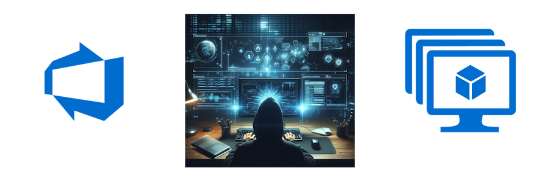

# Activate CICD with Azure DevOps Using YML and Bicep

In this workshop, you will learn how to use Azure DevOps to automate common tasks like building, testing, and deploying your code. You will learn how to create a pipeline using YML and Bicep, and how to use triggers, variables, and templates to make your pipeline more flexible and reusable. You will also learn how to deploy your code to multiple environments and how to create a library of reusable templates.

We'll start from scratch and build up to a full CI/CD YML pipeline that builds, tests, and deploys a simple web application to Azure. By the end of this workshop, you will have a solid understanding of how to use Azure DevOps to automate your development process and how to create a reusable pipeline components that can be easily adapted to different projects and environments.

## Getting Started

You will need an Azure DevOps Organization and Project in order to complete this workshop. If you don't already have an Azure DevOps Organization, you can create one for free at [dev.azure.com](http://dev.azure.com). You will also need an Azure Subscription to deploy resources to Azure.  For more detailed information on setting an organization and project, see the [Create an Azure DevOps Project](/Labs/setup/1-Create-Azdo-Project.md) document for more information.

Once we proceed to the Bicep part of the course, you will also want an editor like VS Code to edit the YML and Bicep files, and a few key extensions to make things better. See the [Visual Studio Code Setup](/Labs/setup/2-Visual-Studio-Code.md) document for more information.

If you need a Build Agent for this class, you can refer to the [Creating a Custom Build Agent](/Labs/build-agents/desktop-runner/readme.md) document to assist you in creating it. You can use the default of the Microsoft Hosted Agents, but if you have a large class it may be better to each have your own custom custom agent.

## Labs

* [YML Pipeline Labs](./Labs/yml/readme.md)

* [Bicep Labs](./Labs/bicep/readme.md)

## Workshop Origins

The YML portion of this workshop is loosely based on [a lab](https://github.com/heoelri/adopac) that was initially created by `Rathish Ravikumar` and `Heyko Oelrichs` of Microsoft for an internal training event, and was then reorganized and updated by `Lyle Luppes` to add more modules and content.
